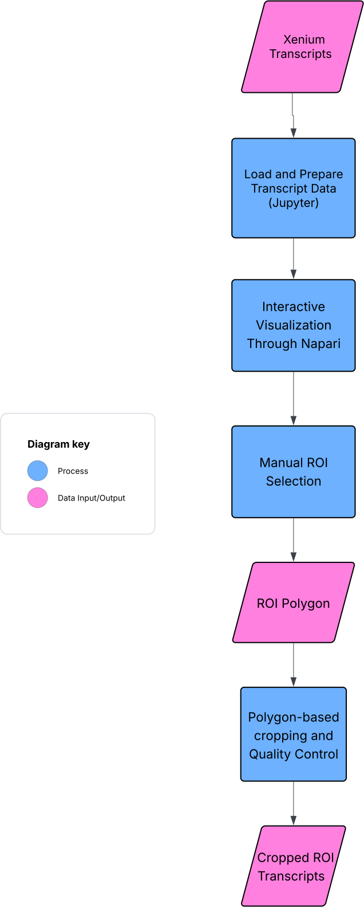
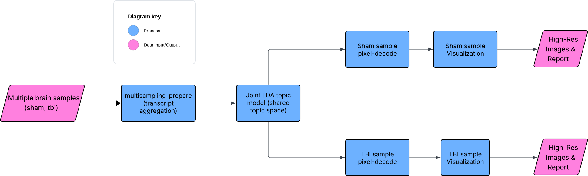

# Analysis Workflows

This directory contains **high-level workflow diagrams** illustrating how
Xenium transcript data are processed through ROI cropping and punkst / FICTURE
for different analysis scenarios.

Each workflow is provided as an SVG flowchart to support:
- conceptual understanding
- reproducibility
- poster and presentation use

---

## Available workflows

### Single-sample workflow

Applies punkst / FICTURE to a single Xenium sample, optionally after ROI-based
transcript cropping.

📄 Diagram:  

---

### Multi-sample workflow

Jointly analyzes multiple Xenium samples using shared latent factors, with
support for ROI-cropped inputs and large-scale orchestration.

📄 Diagram:  

---

## Notes

These diagrams are intended to describe **logical data flow**, not exact command
syntax. Implementation details may vary depending on dataset size and compute
environment.
